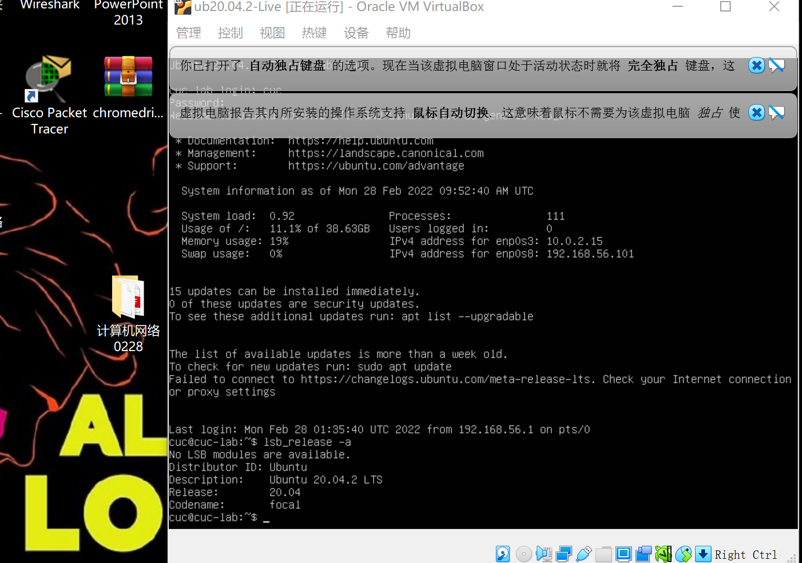
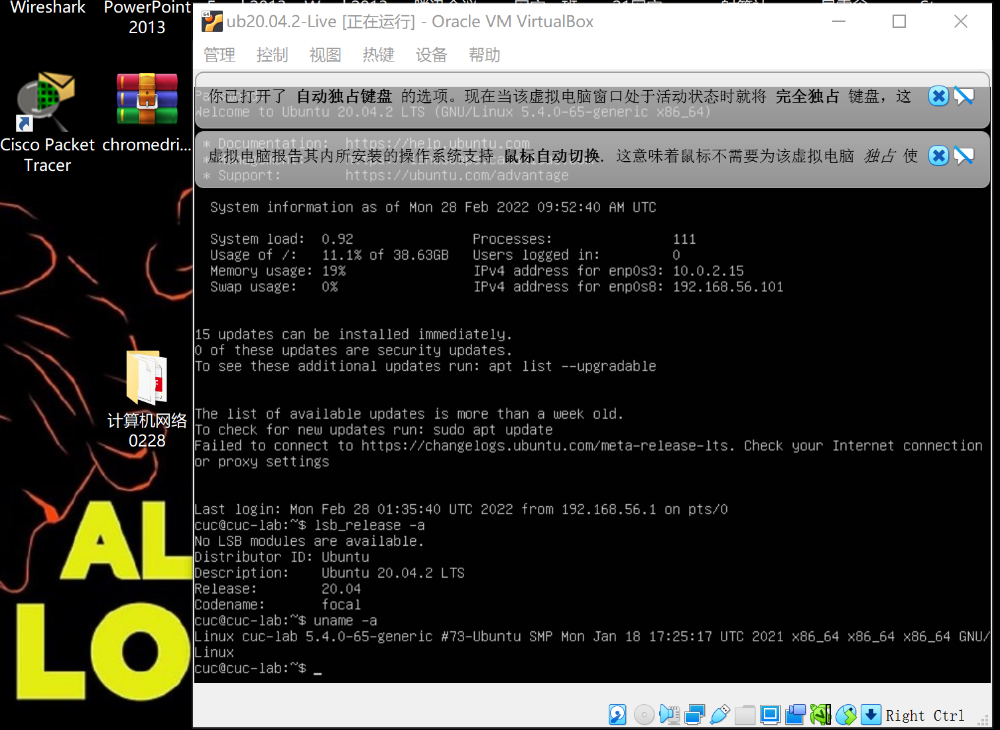
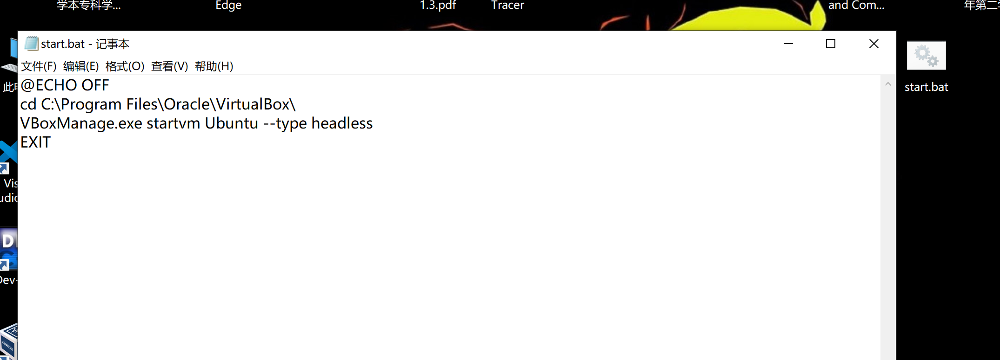
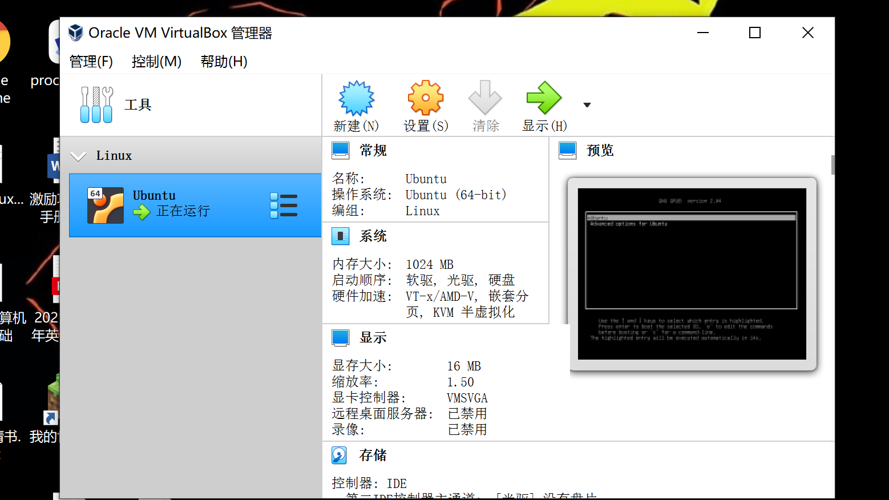
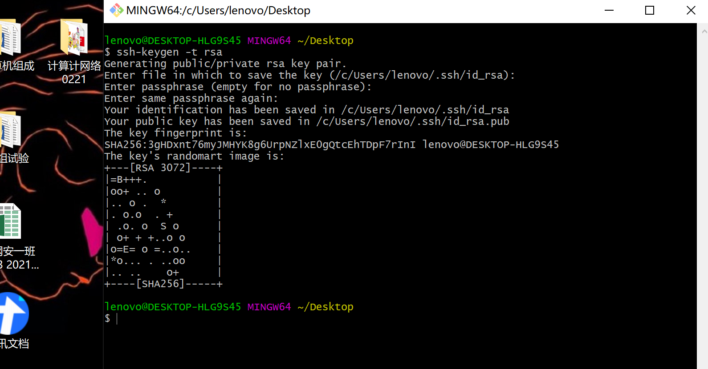
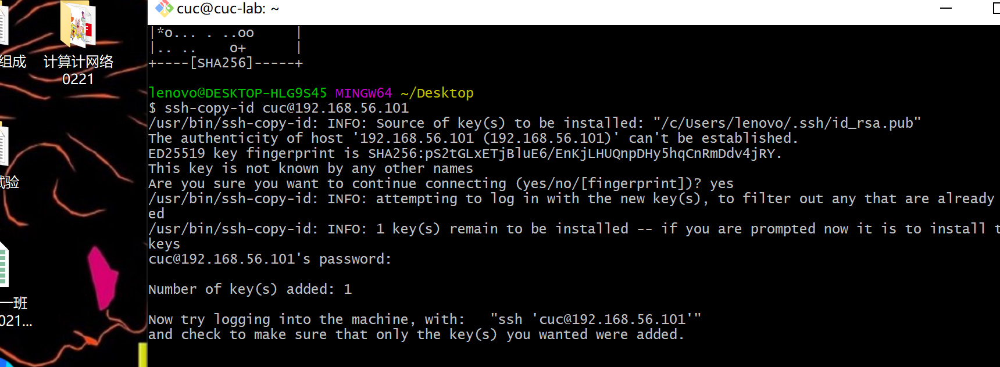
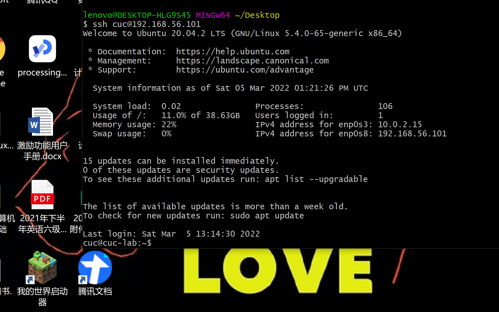

scp 用户名@xxx.x.x.x:/home/用户名/.ssh/id_rsa 目标路径
# 1.
```
//查看发行版基本信息
lsb -release -a 
```


```
//查看内核版本信息
uname -a
```


# 2.
首先在桌面创建.bat文件，里面的代码为
```
@ECHO OFF
cd C:\Program Files\Oracle\VirtualBox\
VBoxManage.exe startvm Ubuntu --type headless
EXIT
```

然后将该bat文件拖入`C:\ProgramData\Microsoft\Windows\Start Menu\Programs\StartUp`的目录下，就可以实现自动启用了



# 3.
用下面的代码实现将本机文件复制到远程服务器上
```
scp /home/administrator/（本地文件的绝对路径）news.txt（要复制的文件） root@192.168.6.129:（远程服务器的ip）/etc/squid（将文件复制到位于远程服务器上的路径）
```
用下面的代码实现虚拟机和宿主机之间的文件传输
```
scp user_name@host_ip:source_path/file target_path/file
```

# 4.
使用
```
ssh-keygen -t rsa
```
生成本机的公私钥；

接着用
```
ssh-copy-id cuc@192.168.56.101
```
把主机上生成的公钥传到cuc@192.168.56.101中；

就搞定了~
